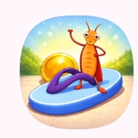
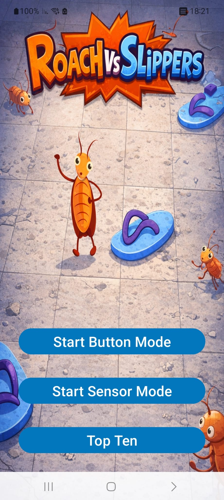
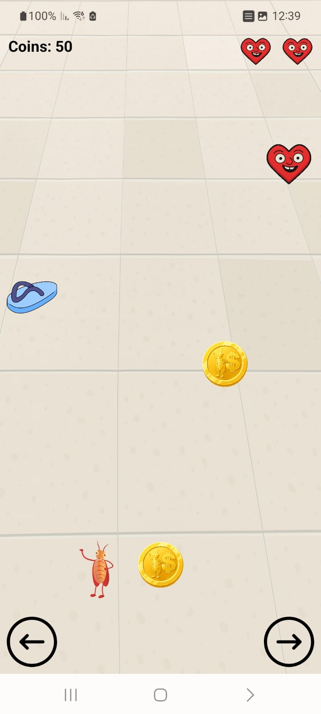
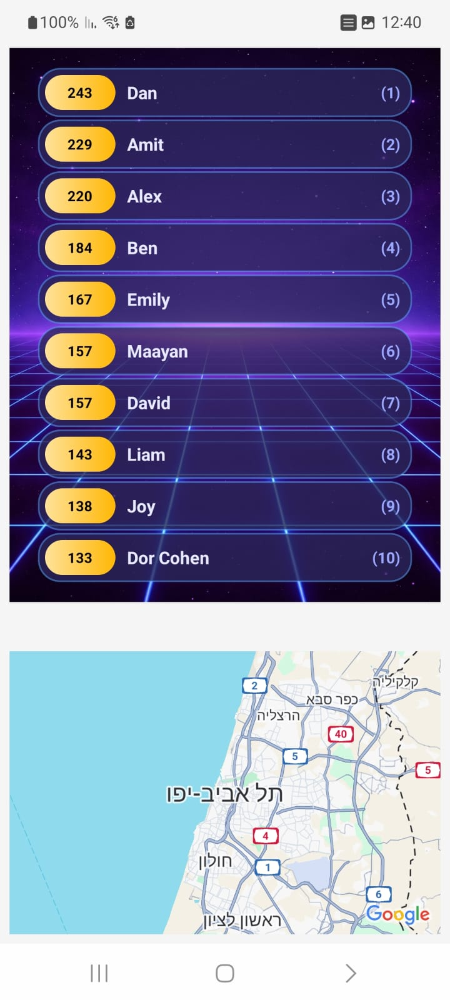
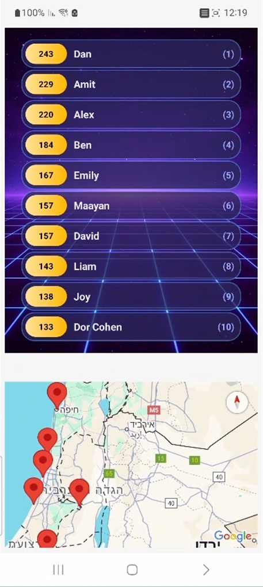

# RoachVsSlippers – Android Game

## 📱 Project Description
This project is an Android game developed as part of an academic assignment.

The player controls a roach that must avoid falling slippers while
progressing forward on a multi-lane road(5).  
The goal is to survive as long as possible and achieve the highest distance score.

---

## 🎮 Gameplay Features
- Button-based or sensor based controls
- Lane based movement
- Falling obstacles (slippers)
- Collectible coins and hearts
- Lives system with visual indicators
- Distance (odometer) score tracking
- Game Over screen with score summary
- Player name input
- Top 10 high scores list
- Custom application launcher icon

---

## 🪙 Coins and Score System
- Coins appear randomly during gameplay
- Collecting a coin increases the player's coin score by 10 points
- The coin score is displayed on screen during the game
- The Top Ten high scores are based solely on the distance (odometer),
  which represents how long the player survived in the game

---

## ❤️ Lives System
- The player starts the game with a limited number of lives(❤️❤️❤️)
- Colliding with a falling obstacle (slipper) reduces one life
- When all lives are lost, the game ends
- Heart items may appear during gameplay
- Collecting a heart restores one life, up to the maximum number of lives
- The current number of lives is displayed visually on the screen

---

## 📱 Sensor Controls
When playing in sensor mode, the game uses the device sensors:

- Tilting left / right moves the player between lanes
- Tilting forward increases the game speed
- Tilting backward decreases the game speed
- Neutral position restores normal speed

---

## 🏆 Top Ten Scores
- High scores are stored locally using SharedPreferences
- Only the top 10 scores are kept
- Scores are sorted by distance achieved
- Each score contains the player name and distance
- Scores are displayed using a RecyclerView

---

## 🗺️ Map Integration
- Google Maps SDK integration
- The Top Ten screen is divided into two fragments:
    - A list of the Top 10 scores
    - A map displaying score locations
- Clicking on a score highlights its location on the map
- Locations are generated within different areas in Israel
- Multiple markers can be displayed simultaneously (up to 10)

---

## 🧩 App Architecture

### Interfaces
The `interfaces` package contains callback interfaces used for communication
between different components of the app.

- `TiltCallback`  
  Handles device tilt events and translates them into player movement
  and speed control.

- `CallbackTopTenClicked`  
  Handles click events on Top Ten items and passes location data to the map.

---

### Game Logic
The `logic` package contains the core game logic and data management classes.

- `GameManager`  
  Manages the game state, including player movement, lives, collisions,
  distance tracking, speed changes, and game over logic.

- `Score`  
  A data class representing a single high score entry.

- `TopTenManager`  
  A Singleton class responsible for managing the Top 10 high scores list.
  Scores are persisted locally using SharedPreferences and Gson.

---

### User Interface (UI)
The `ui` package contains all user interface components of the app.

- `MainActivity` - Main gameplay screen
- `MenuActivity` - Control mode selection and navigation
- `GameOverActivity` - Displays final score and player name input
- `TopTenActivity` - Hosts the Top Ten list and map fragments
- `TopTenFragment` - Displays the Top Ten scores list
- `MapFragment` - Displays score locations on Google Maps
- `TopTenAdapter` - Binds score data to RecyclerView items

---

### Utilities
The `utilities` package provides shared helper and manager classes, including:
- SharedPreferences management
- Sound playback
- Vibration and toast notifications
- Tilt detection using sensors
- Game constants and object definitions

---

## 🛠️ Technologies Used
- Kotlin
- Android SDK
- RecyclerView
- Fragments
- Google Maps SDK
- SharedPreferences
- Sensors API

---

## 📸 Screenshots

### App Icon
| Icon |
|------|
|  |

---

### Gameplay Modes
| Menu | Button Mode | Sensor Mode |
|------|-------------|-------------|
|  |  |  |

---

### Scores & Map
| Top Ten | Map |
|---------|-----|
|  |  |

---

## 📹 Demo Video
A short video demonstrating the gameplay and application features
is provided as part of the assignment submission.

The Link:

https://drive.google.com/file/d/1Ru4171DXyrtYcRmXaXXl7JMNkSIIjaji/view?usp=sharing

